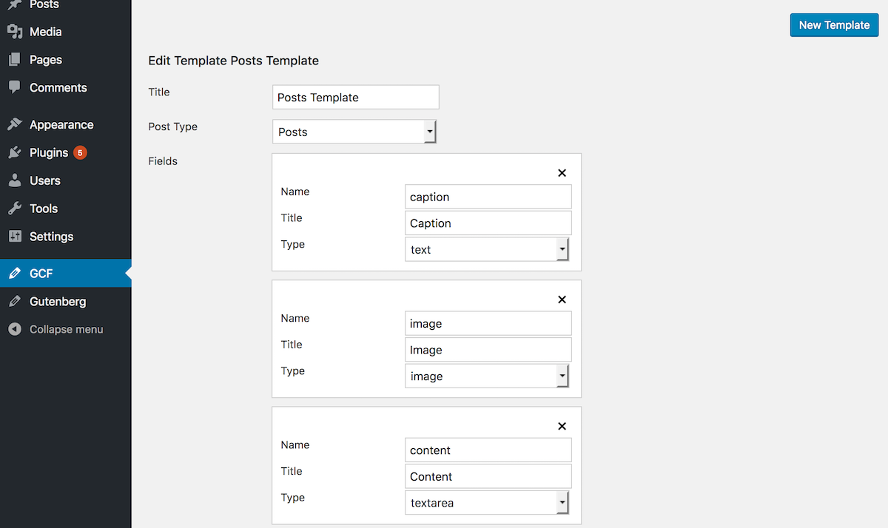
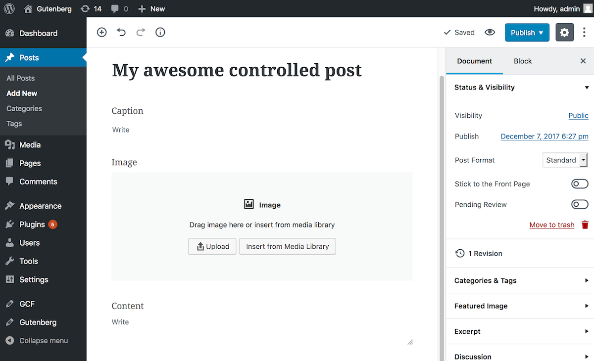

# Gutenberg Custom Fields

Gutenbeg Custom Fields allows you to control the content of the Gutenberg edit screen by creating pre-filled templates.

Navigate to the "GCF" admin page, create a new template, select a post type and add fields as you wish.

The Gutenberg Editor will be pre-filled with the corresponding post type's template.

### Features

 - Customize the title, the name of the post_meta key and the type of the field.
 - Several fields types available: Text, Textarea, Image, Number, Email and more to come.
 - Based on Gutenberg Native Extensibility APIs (blocks and templates).

### Screenshots

**Create a template**

**Write a new post with a prefilled template**

